# Marketplace

A full-stack marketplace application built with Next.js (frontend) and NestJS (backend).

## 📊 System Architecture



## 🚀 Live Demo

- Frontend: [https://marketplace-frontend-woad-kappa.vercel.app](https://marketplace-frontend-woad-kappa.vercel.app)
- Backend API Documentation: [https://backend-or3n.onrender.com/api/docs](https://backend-or3n.onrender.com/api/docs)

## 🛠️ Tech Stack

### Frontend
- Next.js
- TypeScript
- Tailwind CSS
- React Query
- Axios

### Backend
- NestJS
- TypeScript
- PostgreSQL
- TypeORM
- JWT Authentication
- Swagger/OpenAPI

## 📋 Prerequisites

- Node.js (v16 or higher)
- npm or yarn
- PostgreSQL

## 🔧 Setup Instructions

### Backend Setup

1. Clone the repository
```bash
git clone <repository-url>
cd marketplace/backend
```

2. Install dependencies
```bash
npm install
```

3. Set up environment variables
```bash
cp .env.example .env
# Update the environment variables in .env file
```

4. Run database migrations
```bash
npm run migration:run
```

5. Start the development server
```bash
npm run start:dev
```

### Frontend Setup

1. Navigate to the frontend directory
```bash
cd ../frontend
```

2. Install dependencies
```bash
npm install
```

3. Set up environment variables
```bash
cp .env.example .env.local
# Update the environment variables in .env.local file
```

4. Start the development server
```bash
npm run dev
```

## 🔐 Admin Access

For administrative access to the platform, use the following credentials:

- Email: admin@example.com
- Password: guessme

## 📚 API Documentation

The API documentation is available at [https://backend-or3n.onrender.com/api/docs](https://backend-or3n.onrender.com/api/docs). It provides detailed information about all available endpoints, request/response formats, and authentication requirements.

## 🤝 Contributing

Contributions are welcome! Please feel free to submit a Pull Request.

## 📝 License

This project is licensed under the MIT License - see the LICENSE file for details.
